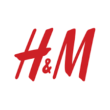

# HnM 사용자 구매정보 데이터로 추천시스템

 
 
## Team
<table>
  <tbody>
    <tr>
      <td align="center"><a href="https://github.com/suddy78"> <b>김수연</b></a></td>
      <td align="center"><a href="https://github.com/jmeagnes"> <b>정모은</b></a></td>
      <td align="center"><a href="https://github.com/jiminchur"> <b>지민철</b></a></td>
      <td align="center"><a href="https://github.com/ohyu628"> <b>오유빈</b></a></td>
      <td align="center"><a href="https://github.com/jaechoi97"> <b>최재웅</b></a></td>
    </tr>
  </tbody>
</table>
 
 

## Use Tech
 

## 전체 프로젝트 일정
* 프로젝트 일정 : 2023.11.09 ~ 2023.11.15
 

## 프로젝트 개요
- 목적 :
이 프로젝트의 목적은 HNM 사용자의 과거 구매 내역 데이터를 분석하여, 개인화된 상품 추천을 제공함으로써 사용자의 쇼핑 경험을 향상시키고, 구매 전환율을 증가시키는 것입니다.

- 개발배경 :
최근 온라인 쇼핑의 증가와 함께 사용자의 취향과 필요를 정확히 파악하는 것이 중요해졌습니다. 고객 맞춤형 상품 추천은 사용자 만족도를 높이고, 장기적인 고객 충성도를 구축하는 데 핵심 역할을 합니다.
 

## 요구사항 정의
### 기능 명세서

1. 로그인/회원가입 기능

- 사용자는 개인화된 추천을 받기 위해 로그인하거나 회원가입을 할 수 있어야 합니다.
2. 구매 내역 기반 추천 기능

- 과거 구매 내역을 분석하여 사용자에게 상품을 추천합니다.
- 사용자는 추천받은 상품 목록을 볼 수 있습니다.
3. 사용자 피드백 기능

- 사용자는 추천받은 상툼에 대해 피드백(좋아요/싫어요)을 제공할 수 있습니다.
- 사용자 피드백은 추천 알고리즘의 정확도를 개선하는 데 활용됩니다.
3. 상품 검색 기능

- 사용자는 특정 상품을 검색할 수 있습니다.
4. 상품 상세 페이지

- 사용자는 상품에 대한 상세 정보를 볼 수 있습니다.
5. 보안 기능

- 시스템은 사용자 데이터를 안전하게 보호합니다.
- 사용자의 개인정보와 구매 내역은 암호화하여 저장

### 요구사항 정의서
1. 데이터 수집 및 처리

- kaggle에서 진행되었던 [H&M Personalized Fashion Recommendations](https://www.kaggle.com/competitions/h-and-m-personalized-fashion-recommendations/data)대회의 데이터셋을 이용하여 프로젝트를 진행

2. 사용자 프로필 분석

- 사용자의 구매 패턴, 선호하는 상품 카테고리 등을 분석합니다.
3. 추천 알고리즘 개발

- 사용자의 과거 구매 데이터를 기반으로 상품을 추천할 수 있는 알고리즘을 개발합니다.
- 알고리즘 성능을 평가하고 최적화합니다.
4. 웹 인터페이스 개발

- 사용자에게 추천 상품을 보여줄 수 있는 웹 페이지를 개발합니다.
- 사용자 인터페이스는 직관적이고 사용하기 쉬워야 합니다.
5. 보안 및 개인정보 보호

- 사용자의 개인정보와 구매 데이터를 안전하게 보호합니다.

## 웹페이지 설계서
웹페이지 설계서
## DB 설계서
DB 설계서
## 웹페이지
웹페이지랑 -> 상세 설명
## 모델서빙
flask
## 시연영상
영상 gif
## 회고
회고
